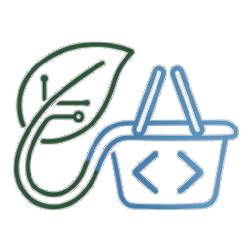

# NextFood — Reto "¿Cuánta comida puedes salvar?"



**NextFood** es nuestra solución para el reto **AI for Action**
(<https://aiforaction.tech/comida>): asignar comida perecedera de supermercados a
bancos de alimentos en una tarde, contra un simulador de eventos discretos. El
nombre y el logotipo (hoja que se vuelve cesta) son la marca que le dimos al
producto; el repositorio se llama `food-rescue` por el reto, no por la marca.

La entrega es un **solucionador unificado** (`ml/solver_scorer.py`): una capa de IA
**integrada** (aprendizaje por imitación) que combina un modelo de puntuación
(scorer, LightGBM LambdaRank) con un **guardrail** determinista de cola que
devuelve la decisión al motor de reglas en caso de desperdicio de portador.
Sobre el escenario publicado salva el **58.5%** de la comida. Por debajo hay dos
piezas que se mantienen en el repo y son reproducibles de forma independiente: el
**motor de asignación determinista** (`solver_match_crit.py`) —un emparejamiento
de coste mínimo que se re-ejecuta en cada tic del simulador (5 minutos), con tres
reglas de priorización calibradas empíricamente y **solo biblioteca estándar de
Python**— y el **scorer** por separado. El método de IA está documentado en
[`docs/AI_METHODS.md`](docs/AI_METHODS.md) y la validación en
[`docs/METODOLOGIA.md`](docs/METODOLOGIA.md).

---

## Demo

| | |
|---|---|
| **Vídeo explicativo** | <https://drive.google.com/file/d/1qI1DM7ggbGid23AKZ3uRm408IocD0nqG/view?usp=sharing> |
| **App del voluntariado** | <https://crivote.github.io/food-rescue/ux/> |

**La app se sirve como web estática y necesita un servidor HTTP.** No está pensada para
verse abriendo el fichero con doble clic: los datos se piden con `fetch()` y el código son
módulos ES, así que el navegador los bloquea desde `file://`. Es el comportamiento
esperado, no un fallo. Para servirla en local, desde la carpeta `ux/`:

```bash
python3 -m http.server 8000    # abre http://localhost:8000/
```

El detalle de la interfaz —qué es real, qué es ficticio y cómo se integra con el
motor— está en [`ux/README.md`](ux/README.md).

---

## TL;DR — qué es real, qué es simulado y qué fuentes usamos

**Qué funciona de verdad.** El solucionador de la entrega
(`ml/solver_scorer.py`) es código real y **determinista**: no es un plan
precalculado ni un script que devuelva valores fijos. En cada tic del simulador
puntúa las aristas candidatas con el modelo aprendido y resuelve un emparejamiento
de coste mínimo; el guardrail devuelve el tic al motor de reglas cuando detecta un
desperdicio de portador. El motor determinista (`solver_match_crit.py`) es la base
de la que hereda esa salvaguarda y se ejecuta solo con la biblioteca estándar. La
misma entrada produce siempre la misma salida — se verificó ejecutando dos veces y
obteniendo 58.5% idéntico — y nada está inventado ni ajustado a mano por escenario.

**Qué está simulado.** Los *resultados* (el porcentaje de comida salvada) se miden
sobre el simulador de eventos discretos del reto, no sobre entregas reales de
comida. El escenario publicado (`sample_01`) y los 2000 escenarios de validación
provienen del generador oficial del reto (`generar_escenario.py`, determinista y
con semilla fija). El **58.5%** del escenario publicado es la salida real de ese
simulador ejecutando el solucionador integrado, reproducible con el comando de la
sección *Ejecución*.

**Qué fuentes usamos.** Ninguna teórica — ni papers ni fórmulas tomadas de la
literatura. Toda la calibración (los tres factores del peso y sus valores) es
**pura empiria**: cada parámetro se fijó midiendo su efecto sobre el simulador y
descartando los que no aportaban. `docs/METODOLOGIA.md` registra qué se probó,
qué se refutó y con qué evidencia.

**La salvedad de los datos.** Las fuentes abiertas del reto (OpenStreetMap,
FAO, Eurostat, ReFED, FESBAL, portales municipales) sirven para *dimensionar* el
problema, no para *decidir* en tiempo real: no existe hoy una API donde
supermercados, voluntarios y centros publiquen su estado en vivo. El motor se
alimenta del generador determinista del reto; la capa de datos es intercambiable
solo si existiera ese feed, que es el punto de partida de la visión de producto
de la sección siguiente.

---

## El problema

- **11 voluntarios**, cada uno con posición inicial (su casa), una ventana de 2 h,
  una velocidad (9–15 km/h) y una capacidad de carga (15–30 raciones).
- **43 recogidas** de comida, cada una con posición, número de raciones y hora de
  caducidad.
- **6 bancos de alimentos** (centros) con hora de cierre.
- El simulador avanza en tics de 5 minutos y, en cada tic, espera una lista de
  asignaciones `{voluntario, recogida, centro}`.

**Cada decisión es un solo viaje** (`voluntario → recogida → centro`). No se
encadenan dos recogidas en un viaje. El voluntario queda libre de nuevo tras
entregar en el centro y puede re-despacharse mientras le quede tiempo. Este
*re-despacho* es el corazón del problema.

Dos voluntarios cancelan a mitad de la tarde (a las 19:40 en el escenario
publicado), lo que obliga a **replanificar en caliente**, no a ejecutar un plan
calculado al inicio.

### Métrica

```
porcentaje_salvado   → manda
comidas_por_hora     → desempata
```

## Resultados

Sobre el escenario publicado (`sample_01`, 775 raciones). Las cuatro cifras están
medidas con el mismo simulador y el mismo escenario:

| Solucionador | % salvado | Raciones | Comidas/hora |
|---|---|---|---|
| Greedy de referencia (el del reto) | 42.1% | 326 | 23.1 |
| Matcher base comidas/minuto (`solver_match.py`, sin heurísticas) | 53.2% | 412 | 27.8 |
| Motor determinista (`solver_match_crit.py`) | 55.4% | 429 | 26.9 |
| **Modelo integrado — scorer + guardrail (`ml/solver_scorer.py`)** | **58.5%** | **453** | 25.2 |

**El modelo integrado es el solucionador de la entrega**: +3.1 pts sobre el motor
determinista y +5.3 sobre el matcher base en el escenario publicado. Es el que
hay que ejecutar para reproducir la cifra. Nótese que en el desempate
(`comidas_por_hora`) el motor determinista puntúa algo mejor: el integrado salva
más raciones absolutas repartiendo más horas de voluntariado, lo cual es
favorable porque la métrica principal es el porcentaje salvado y solo se desempata
por hora cuando hay empate — y aquí no lo hay.

En el conjunto de validación (2000 escenarios fuera de muestra, estratificados
por dificultad), el motor supera a ambas referencias en los **cuatro cuartiles**,
y el **modelo integrado** (scorer + guardrail) lo supera a su vez de forma
consistente:

| Cuartil | Greedy | Matcher base | Motor | **Integrado** | Δ integrado vs motor |
|---|---|---|---|---|---|
| Q1 (fácil) | 51.7% | 58.1% | 62.8% | **63.5%** | +0.73 |
| Q2 | 48.0% | 54.9% | 58.9% | **59.9%** | +0.94 |
| Q3 | 45.0% | 51.5% | 54.9% | **55.7%** | +0.77 |
| Q4 (difícil) | 41.5% | 46.6% | 49.9% | **51.0%** | +1.11 |
| **Total** | 46.5% | 52.8% | 56.6% | **57.5%** | **+0.89** |

El modelo integrado gana al motor determinista en **1210/2000** escenarios
(60.5%), con una ventaja de **+0.89 pts** estable en los cuatro cuartiles.

El detalle completo de la validación (parámetros topológicos, índice de
dificultad, umbrales mínimo y máximo, y la justificación empírica de cada
parámetro) está en [`docs/METODOLOGIA.md`](docs/METODOLOGIA.md).

## Cómo funciona el motor

`decidir(estado)` recibe el estado completo del simulador en cada tic y devuelve
las asignaciones de ese tic. En cada llamada:

1. **Emparejamiento de coste mínimo** (min-cost flow) entre voluntarios libres y
   recogidas pendientes, optimizando el peso de cada viaje candidato.
2. El peso de cada viaje combina **tres reglas operativas** (todas en forma de
   factor multiplicativo, calculadas sobre la base `comidas/duración`):

```
peso = (comidas / duración)                       ← eficiencia del viaje (base)
     × (1 + BETA / n_cap)                         ← criticidad (exclusividad)
     × (1 + DESIERTO · m)                         ← bono de lejanía (m ∈ {1,2})
     × (1 − NEAR_K · (NEAR_KM − d)/NEAR_KM)       ← malus de cercanía
```

- **Criticidad** (`n_cap`): número de voluntarios capaces de rescatar esa recogida
  *en su ventana completa*, recalculado en cada tic. Una recogida que solo un
  voluntario puede alcanzar recibe más peso. Es la regla que más aporta.
- **Desierto**: bono para recogidas lejanas a su centro más cercano (> 5 km),
  con `m=2` si el voluntario está en su posición de partida (primer viaje, con
  coste de oportunidad de ida desde casa) y `m=1` en los re-despachos. El bonus
  es continuo: en un escenario sin recogidas lejanas vale exactamente 1 (no
  añade ruido). El factor `m` es parte de esta regla, no un cuarto factor
  independiente.
- **Cercanía**: malus para recogidas pegadas a su centro (< 4 km), que son viajes
  baratos y conviene no consumir mientras quede tiempo. Es el espejo simétrico
  del desierto.

Los parámetros (`BETA=1.4`, `DESIERTO=0.2`, `DESIERTO_KM=5.0`, `NEAR_K=0.5`,
`NEAR_KM=4.0`) son **fijos y globales**: se verificó que hacerlos depender de las
características de cada escenario no aporta mejora, y que su valor óptimo es el
mismo en los cuatro cuartiles de dificultad.

## El método de IA (integrado con guardrail de cola)

El motor de arriba es un matcher *local*: en cada tic optimiza el presente sin
ver el coste de oportunidad futuro (qué recogida sacrifica al consumir un
voluntario capaz). Su límite no está en los pesos —se verificó que modularlos no
aporta— sino en esa **miopía secuencial**. El método para atacarla fue un
**aprendizaje por imitación** (behavioral cloning) del solucionador exacto:

- **Profesor (offline).** `optimo_exacto.py` resuelve cada escenario a óptimo
  entero con CP-SAT. Es el oráculo que conoce la asignación global correcta.
- **Alumno (online, determinista).** Un modelo de puntuación (LightGBM,
  LambdaRank) aprende, a partir de los planes óptimos, a dar a cada arista
  `(voluntario, recogida)` el peso que habría llevado al profesor a elegirla.
  Sustituye la **fórmula artesanal del peso**, manteniendo intacta la capa de
  emparejamiento (`min-cost flow`) que ya garantiza factibilidad y determinismo.
- **Por qué es determinista.** El profesor corre offline (da igual cuál de sus
  soluciones óptimas empatadas devuelva); el alumno tiene pesos fijos, así que
  toda la cadena online produce siempre la misma salida.

**Resultado (medido, fuera de muestra, 2000 semillas estratificadas).** El
modelo integrado (scorer + guardrail) **bate al motor determinista en los
cuatro cuartiles de dificultad**, sobre el mismo set de la tabla de resultados
anterior:

| Cuartil | Motor | Integrado | Δ |
|---|---|---|---|
| Q1 (fácil) | 62.8% | 63.5% | +0.73 |
| Q2 | 58.9% | 59.9% | +0.94 |
| Q3 | 54.9% | 55.7% | +0.77 |
| Q4 (difícil) | 49.9% | 51.0% | +1.11 |
| **Total** | **56.6%** | **57.5%** | **+0.89** |

Es una mejora **real y estable** (+0.89 pts, gana en el 60.5% de los casos),
pero **modesta**: el margen in-sample (+2.2 pts) se reduce fuera de muestra por
overfitting parcial. Las variantes para ampliarla (features globales, labels
ponderados) no aportaron; el límite es estructural — el profesor optimiza un
plan global, y sus etiquetas por tic solo codifican decisiones locales.

**La integración final añade un guardrail de cola.** El solucionador unificado
`ml/solver_scorer.py` combina el scorer con una salvaguarda determinista: cuando
el scorer desperdicia un voluntario de **capacidad 30** en una recogida pequeña
(y el motor determinista lo mandaría a una grande), se devuelve la decisión del
motor para ese tic. No sube la media (ya es modesta), pero **recorta el peor
caso**: en n=800 la pérdida media del decil peor cae de −5.79 a −3.39 pts, y en
los 15 peores fallos del scorer mitiga 12 sin empeorar ninguno. Detalle en
[`docs/AI_METHODS.md`](docs/AI_METHODS.md) §10.

El detalle técnico está en [`docs/AI_METHODS.md`](docs/AI_METHODS.md) y
[`docs/METODOLOGIA.md`](docs/METODOLOGIA.md), sección 7.

> **Artefactos del scorer versionados.** El modelo entrenado
> (`models/scorer_full.txt`, 2.7 MB) y los planes CP-SAT que sirvieron como
> profesor (`labels/planes.jsonl`, 600 escenarios OPTIMAL, 665 KB) **están
> commiteados** en este repo: son la fuente de verdad del behavioral cloning.
> El `python3 ml/solver_scorer.py` los usa directamente; solo necesita
> `lightgbm` (el motor `solver_match_crit.py`, que es la base determinista del
> solucionador, sigue siendo stdlib puro). Si quieres re-entrenar (más semillas, otras
> features, validar reproducibilidad), ejecuta `bash ml/build_scorer.sh`
> (~4 h en CPU 16 cores, ~2 h en 4 cores; necesita además `ortools`).

## Cómo lo construimos — herramientas y equipos

Esta sección declara el *tooling*, no el método. Ninguna de estas herramientas
toma decisiones en tiempo de ejecución: **el solucionador que se puntúa es
determinista y no llama a ningún servicio externo** (verificado: `decidir(estado)`
solo usa la biblioteca estándar y el modelo versionado). Las llamadas que se
cuentan abajo son del **proceso de construcción** — exploración, código,
documentación y las ilustraciones del prototipo.

**Agente de IA.** El desarrollo se llevó con **[Hermes
Agent](https://hermes-agent.nousresearch.com/)** (Nous Research) como orquestador,
con enrutado de modelos por tarea sobre Ollama Cloud y OpenRouter. Consumo de la
cuenta durante la semana de construcción (panel del proveedor; Ollama no desglosa
por proyecto, así que son cifras de la cuenta, no solo de este reto):

| Modelo | Llamadas | Para qué se usó aquí |
|---|---|---|
| `deepseek-v4.1-flash` | **2104** | volumen: edición de código, benchmarks, docs |
| `deepseek-v4-pro:0813` | **1475** | razonamiento: diseño de features, depuración fina |
| `gemma4:31b` | **704** | respuestas rápidas, comprobaciones cortas |
| `minimax-m3` | 84 | análisis de casos límite |
| `glm-5.3` | 47 | tareas puntuales |

En total, **~4400 llamadas** en la ventana del reto. El reparto de modelos es el
del enrutado por dificultad: el modelo barato para el volumen y el de
razonamiento para las decisiones de diseño.

**Generación de imágenes.** **ComfyUI** local con **FLUX.2 klein** para las
ilustraciones del prototipo; el logotipo de la marca y el plano se generaron con
**Qwen 3.8** en su chat web. Las seis fotos de locales de `ux/assets/` son
imágenes generadas, no fotografías reales.

**Equipos.**

- **Mini-PC Intel N100** (4 núcleos, 16 GB, sin GPU) — Linux: aquí vive el agente
  Hermes y aquí corrieron la orquestación y los benchmarks secuenciales. Es el
  setting correcto para medir: se comprobó que paralelizar los *predicts* de
  LightGBM por semilla en más núcleos daba resultados **peores** que la ejecución
  secuencial (el booster ya usa sus propios hilos internos), así que los
  benchmarks finales se corrieron aquí a propósito.
- **ASUS TUF Gaming FA506IV** (AMD Ryzen 7, 16 GB, **RTX 2060 mobile** 6 GB) —
  Linux: aquí corrieron **ComfyUI** (las ilustraciones) y el **batch pesado de
  600 semillas** del etiquetado CP-SAT, por tener más núcleos que el N100.

> **Qué no usamos.** Ningún servicio de IA en el bucle de decisión, ninguna API
> en tiempo real y ningún dato real de personas u organizaciones. El solver que
> se puntúa corre con `lightgbm` (o solo la biblioteca estándar, en el caso del
> motor) y nada más.

## Requisitos e instalación

| Componente | Dependencias | Notas |
|---|---|---|
| `ml/solver_scorer.py` (**la entrega**: scorer + guardrail) | `lightgbm` | Modelo versionado en `models/scorer_full.txt`. Reproduce 58.5% en `sample_01`. |
| `solver_match_crit.py` (motor determinista, sola stdlib) | **solo stdlib** | Sin pip install. Reproduce 55.4% en `sample_01`. Base de la que el integrado hereda el guardrail. |
| `explicar_decision.py` | stdlib + acceso HTTP opcional | LLM opcional vía env (`LLM_ENDPOINT`/`LLM_MODEL`/`LLM_API_KEY`); sin esas vars usa plantilla determinista. |
| `solver_match.py` (matcher base, referencia) | **solo stdlib** | Sin heurísticas. Reproduce 53.2% en `sample_01`. |
| `optimo_exacto.py` (techo de referencia) | `ortools` | Solo si quieres re-ejecutar el solver exacto. |
| `ml/etiquetar_cpsat.py` + `ml/entrenar_variantes.py` (re-generar scorer) | `ortools` + `lightgbm` + `numpy` | Solo si corres `ml/build_scorer.sh`. |

Para ejecutar la entrega completa: `pip install lightgbm` y luego `python3 ml/solver_scorer.py`. Si además quieres el motor determinista sin instalar nada, `python3 solver_match_crit.py` corre con la biblioteca estándar.

## Ejecución

Requisitos: Python 3.10+. El solucionador integrado (la entrega) necesita
`lightgbm`; el motor determinista y las referencias funcionan con la biblioteca
estándar.

```bash
# el solucionador de la entrega: scorer + guardrail (necesita lightgbm)
python3 ai-for-good-72h-harness/comida/simulate.py \
    --scenario ai-for-good-72h-harness/comida/scenarios/sample_01.json \
    --solver ml/solver_scorer.py
```

Devuelve **58.5%** en el escenario publicado:

```json
{
  "metrica_principal": "porcentaje_salvado",
  "desempate": "comidas_por_hora",
  "porcentaje_salvado": 58.5,
  "comidas_rescatadas": 453,
  "comidas_totales": 775
}
```

Para correr el **motor determinista** (sin instalar nada, solo biblioteca estándar):

```bash
python3 ai-for-good-72h-harness/comida/simulate.py \
    --scenario ai-for-good-72h-harness/comida/scenarios/sample_01.json \
    --solver solver_match_crit.py
```

Devuelve 55.4% (429 raciones). El guardrail del solucionador integrado se puede
desactivar con la variable de entorno `GUARDRAIL=0`, que deja solo el scorer
(58.5% también en este escenario: la salvaguarda actúa sobre todo en la cola de
casos difíciles, no en la media).

## Estructura

```
ml/solver_scorer.py             ← LA ENTREGA: scorer + guardrail (58.5% en sample_01)
solver_match_crit.py            ← motor determinista (solo stdlib, 55.4%)
solver_match.py                 ← matcher base (referencia sin heurísticas, 53.2%)
docs/METODOLOGIA.md             ← validación completa: metodología y evidencia
docs/AI_METHODS.md              ← método de IA: scorer por imitación (técnico)
ai-for-good-72h-harness/        ← simulador del reto (MIT, ajeno)
    comida/simulate.py          ← motor del simulador
    comida/generar_escenario.py ← generador determinista de escenarios
    comida/baseline_greedy.py   ← greedy de referencia
    comida/scenarios/sample_01.json
firma_global.py                 ← parámetros topológicos de un escenario
estratifica_cuartiles.py        ← estratificación por cuartiles de dificultad
bench_alcanzable.py             ← umbral máximo simplificado (techo por ítem)
optimo_exacto.py                ← óptimo entero de un escenario (CP-SAT)
valida_beta_14.py               ← validación por pares del parámetro BETA
ml/                             ← capa de IA (aprendizaje por imitación)
    etiquetar_cpsat.py          ← genera el material de entrenamiento del scorer
    scorer_features.py          ← features del scorer (fuente única)
    entrenar_variantes.py       ← entrena el scorer (LightGBM LambdaRank)
    solver_scorer.py            ← motor online con el scorer aprendido
    bench_estratificado.py      ← motor vs scorer fuera de muestra, por cuartiles
    build_scorer.sh             ← regenera labels/planes.jsonl + models/scorer_full.txt (~4h CPU)
labels/                         ← planes CP-SAT versionados (600 escenarios, fuente de verdad del behavioural cloning)
    planes.jsonl                ← 572 OPTIMAL + 28 FEASIBLE, ~665 KB
models/                         ← modelos LightGBM versionados
    scorer_full.txt             ← 2.7 MB, LambdaRank (binario, 25 features)
explicar_decision.py            ← traduce una decisión a lenguaje natural (LLM)
ux/                             ← prototipo de app del voluntario (web estática, sin build)
    README.md                   ← qué es real, qué es ficticio y cómo se integra con el motor
    index.html                  ← solo estructura + sprite de iconos
    js/                         ← flujo, estado, pantallas y el diccionario de nombres
    css/                        ← tokens, layout y componentes
    data/turno.json             ← la traza REAL del motor (generada, no escrita a mano)
    build_turno.py              ← regenera data/turno.json desde el motor
    build_mensajes.py           ← escribe el mensaje de cada misión (LLM + contexto del turno)
    assets/                     ← marca (logo + favicon), plano y fotos de los locales
```

## Visión de producto — NextFood, del simulador al sistema real

**NextFood** es el nombre del producto: el sistema completo que este repositorio
implementa solo en su núcleo de decisión. La marca (hoja que se vuelve cesta)
resume la idea —del excedente vegetal a la cesta de quien lo necesita— y la app
del voluntariado de [`ux/`](ux/) es su primera cara visible.

Este repositorio es el **motor de decisión**, no el sistema completo. El paso a
producción pasa por una pieza que hoy no existe y que habría que diseñar: una
**API abierta** y una arquitectura cloud donde los tres tipos de actor publican y
consumen su estado en tiempo real, **sin compromiso**, bien mediante una app
interactiva o mediante integraciones automatizadas con sus sistemas de
información.

- **Oferentes de excedente** — restaurantes, hoteles, comedores de universidades
  y colegios, intermediarios de alimentación, hipermercados, supermercados.
  Publican *qué* les sobra, *cuándo* caduca y *dónde* está.
- **Voluntarios** — colaboran recogiendo y transportando. Para sostener la
  participación se propone un sistema **gamificado de puntos y recompensas**
  (virtuales y, si se logra patrocinio de una fundación o entidad con interés en
  posicionar su imagen corporativa en recuperación de alimentos, reales).
- **Puntos de recogida y almacenamiento del tercer sector** — bancos de
  alimentos — con capacidad y horario en vivo.

El motor de este repositorio es directamente reutilizable como el núcleo de
decisión de ese sistema: la interfaz `decidir(estado)` no cambia; solo cambia
quién produce el `estado` (el simulador, o la API en tiempo real del sistema).

Como muestra del salto a producto, `ux/` es un prototipo de la app del voluntario
(HTML + CSS + JS vanilla, sin build) **publicado como web estática** y navegable en
<https://crivote.github.io/food-rescue/ux/>. Reproduce el flujo completo del turno
—*misión → aceptar → ir a recoger → cargar → ir a entregar → confirmar entrega →
recompensa*— con gamificación de puntos y seis pantallas.

Los datos **no están escritos a mano**: `ux/data/turno.json` es una traza real del motor
sobre el escenario publicado, y `ux/build_turno.py` la regenera ejecutando el simulador.
Lo que es ficticio es solo la capa de presentación (nombres de comercios y centros,
plano y fotos), porque el escenario es simulado y sus puntos son identificadores
internos. `ux/README.md` separa explícitamente lo real de lo ficticio.

Sobre la explicación de por qué se asignó cada recogida: `explicar_decision.py` traduce
el contexto de decisión del motor a lenguaje natural con un LLM barato (mecanismo
descrito en [`docs/AI_METHODS.md`](docs/AI_METHODS.md), §9).

Ese mismo mecanismo, aplicado al itinerario completo, es el que escribe el **mensaje de
asignación** que ve el voluntario en cada misión: `ux/build_mensajes.py` reproduce el
turno tick a tick con el motor real, arma un contexto por misión (raciones, margen de
tiempo, recorrido, cuántos voluntarios podían llegar, lo que lleva salvado, lo que le
falta para el objetivo y para subir de nivel) y lo traduce a una frase cercana. El
resultado se guarda en `ux/data/turno.json` junto a su contexto, así que cualquier frase
se puede auditar contra los datos de los que salió. **La app publicada no llama a ningún
servicio en tiempo de ejecución**: las frases se generaron al construir el prototipo y
viajan dentro del JSON, igual que el plano o las fotos. Sin LLM disponible el script cae
a una plantilla determinista que usa los mismos datos.

## Licencia

El motor y los scripts de validación de este repositorio están bajo la licencia
**MIT** (ver `LICENSE`), incluida la app del voluntariado de `ux/`. El simulador
(`ai-for-good-72h-harness/`) es ajeno y se distribuye bajo su propia licencia MIT
(ver `ai-for-good-72h-harness/LICENSE`).

Las imágenes de `ux/assets/` son **ilustraciones generadas** para el prototipo (no
fotografías de locales reales, que no existen porque el escenario es simulado):
las generó **ComfyUI con FLUX.2 klein** en local, salvo la marca y el plano, que
salieron de **Qwen 3.8** en su chat web.
